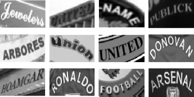
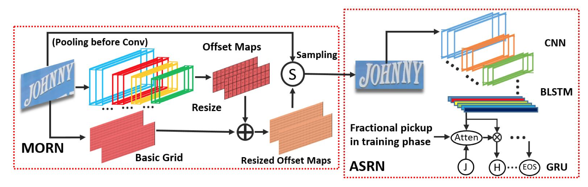
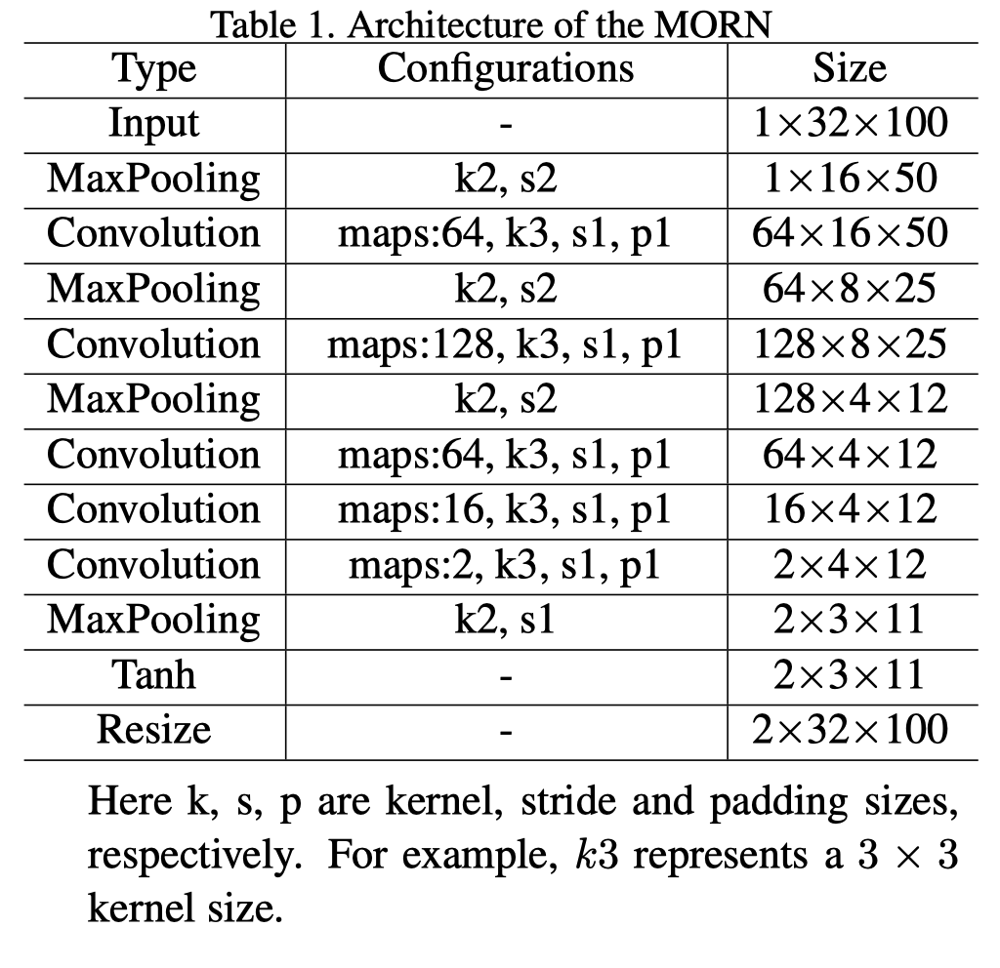
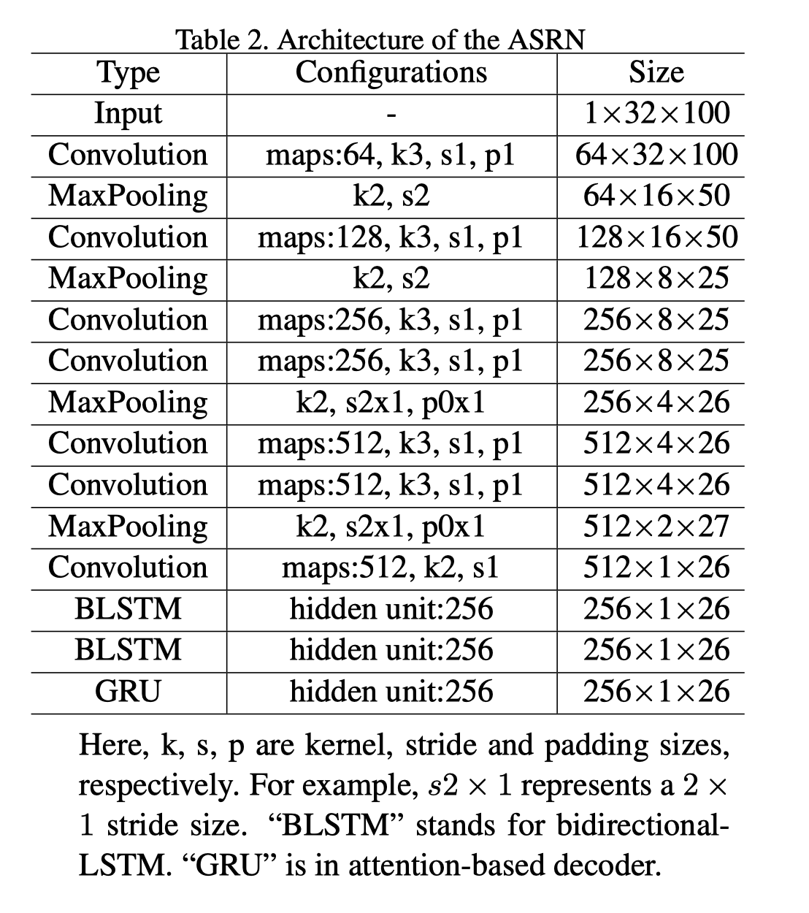
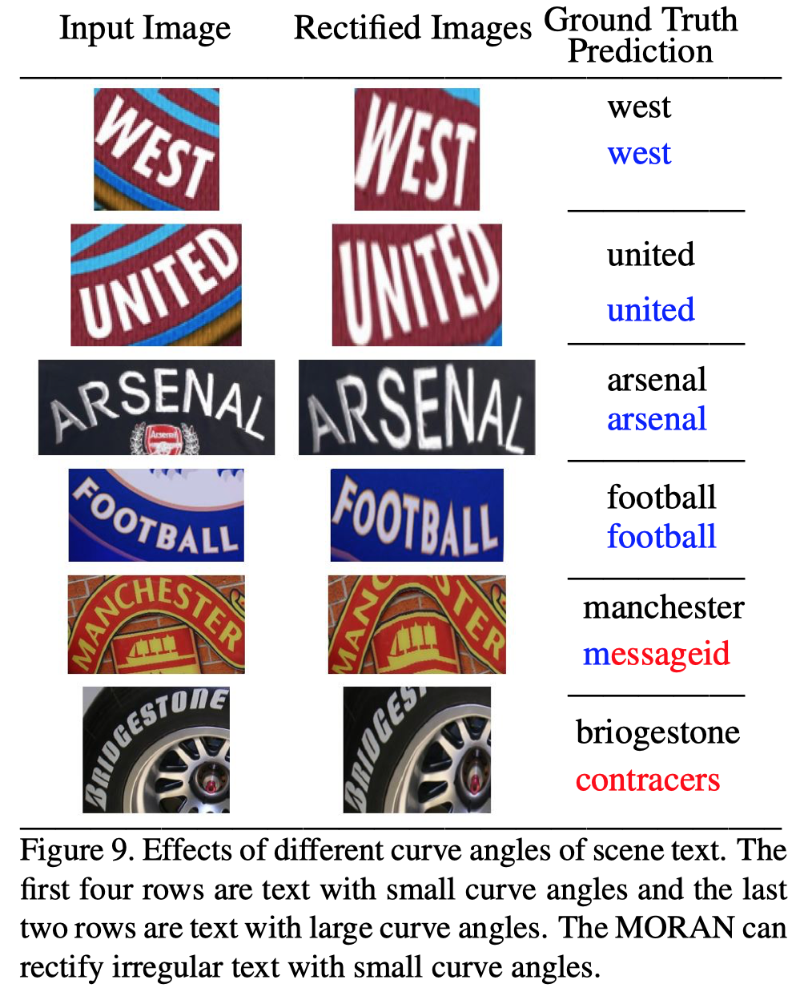

# MORAN: A Multi-Object Rectified Attention Network for Scene Text Recognition

## *The implementation is under active development. Beware of bugs and breaking changes!*

This repository contains a `tf.keras` implementation of **MORAN**, a neural network with rectified attention for general scene text regonition [outperforming all current state-of-the-art approaches with the lexicon-free mode of operation](https://arxiv.org/pdf/1901.03003.pdf).

  

The codebase is heavily inspired by the [Pytorch implementation](https://github.com/Canjie-Luo/MORAN_v2) provided by the original authors.

## Table of Contents

 1. [**Technical Details**](#technical-details)

    * [MORN (Multi-Object Rectification Network)](#morn-multi-object-rectification-network)
    * [ASRN (Attention-based Sequence Recognition Network)](#asrn-attention-based-sequence-recognition-network)

 2. [**Examples & Limitations**](#examples--limitations)

## Technical Details

The model consists of two parts: MORN (Multi-Object Rectification Network), which learns the offsets used for text rectification, and ASRN (Attention-based Sequence Recognition Network), a CNN-LSTM encoder coupled with an attention-based decoder.

The figure below shows the overall structure of the model:

  

### MORN (Multi-Object Rectification Network)

The architecture of MORN is given in the table below:

  

### ASRN (Attention-based Sequence Recognition Network)

The architecture of ASRN is given in the table below:

  

## Examples & Limitations

  

